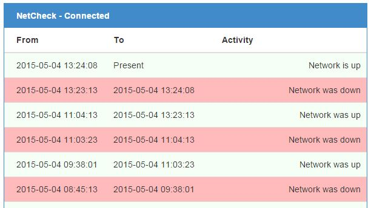

## NetCheck
### Overview
NetCheck Python application for supervising and logging your network connection. NetCheck can also be used to check the connection status of a specific server.

The application will check the network status by pinging a remote site (default www.google.com). 

All events (changes of network status) are logged into a human readable file with time stamps. 

The application also exports an optional WEB interface to view the log.

### Supported platforms
The application is written in Python and has been successfully tested with Python version 2.7. Version 3+ will probably not work.

Both Windows and Linux has been tested successfully. Mac OS X has not been tested, but should work as well. However, the init script provided to start NetCheck as a background process will (probably) only work for Debian based Linux platforms. 

The application has been successfully executed on a [Raspberry Pi](http://www.raspberrypi.org/) hardware using the [Rasbian OS](http://www.raspbian.org/) (based on Debian).

### Basic Installation
Copy the scripts provided here to a folder of your choice. If you are running the software on a Raspberry Pi it is recommended to copy the files to the folder */home/pi/netcheck/*.   
    
### Running
The application is started by executing the *netcheck.py* Python script:

    $ sudo python netcheck.py
    Running NetCheck 1.0.0
    Use Ctrl-C to quit.

The application will run until Ctrl + C are stroked on the keyboard. Execute *python netcheck.py -h* for options.

By default the log is named netcheck.log and is stored in the same directory as netcheck.py.

**NOTE!**
The root/"system administrator" privileges must be used when executing netcheck.py. On Windows, right click the "command prompt" and select "run as administrator" before running NetCheck.

### Enabling the WEB interface and API
You may optionally start the WEB interface (using HTML and JavaScript) and export the WEB API. 

	$ python netcheck.py -w <ip-address> -p <port>
	
Port 8081 is used by default if the -p option is omitted. The startup script, netcheck.sh, will start the WEB interface/API by default.

### Start as a Service
An init.d script is provided for Debian based platforms, such as [Rasbian OS](http://www.raspbian.org/) for [Raspberry Pi](http://www.raspberrypi.org/). Following instruction assumes that the scripts are copied to */home/pi/netcheck/*. If a different folder is used, please change the *DIR* variable in *netcheck.sh*.

    $ cd /home/pi/netcheck
    $ chmod +x netcheck.py
    $ sudo cp init-scripts/linux_debian/netcheck.sh /etc/init.d/
    $ cd /etc/init.d/
    $ sudo chmod +x netcheck.sh
    $ sudo update-rc.d netcheck.sh defaults

Start the service by executing

    $ sudo service netcheck.sh start
    
### Author and license
This application is written by Joel Eriksson and is licensed under the GNU Public License.

### Version history

**1.0.0** (May 5, 2015)
* First release